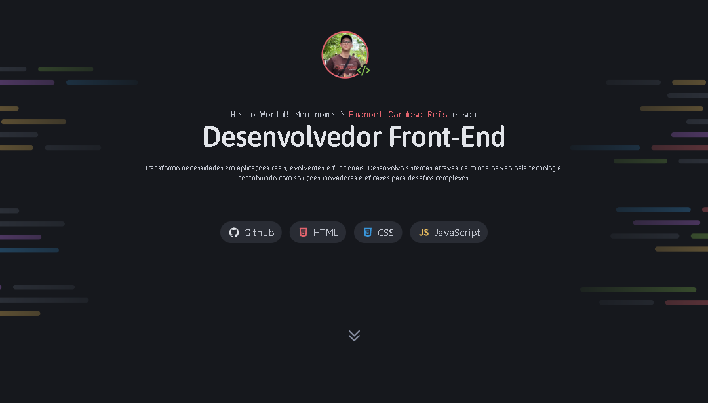

# Portfólio Dev


## Descrição

Portfólio digital de apresentação pessoal desenvolvido para evidenciar experiência, projetos e serviços como desenvolvedor Front-End. O projeto apresenta uma interface moderna e responsiva que demonstra habilidades em desenvolvimento web, design de UX/UI e boas práticas de acessibilidade.



### O que faz o projeto?

- **Apresentação Pessoal**: Exibe informações profissionais e uma breve bio do desenvolvedor
- **Portfolio de Projetos**: Destaca 4 projetos principais com links para visualização ao vivo
- **Catálogo de Serviços**: Apresenta os principais serviços oferecidos (Websites, Design Responsivo, Otimização)
- **Seção de Contato**: Centraliza links de contato e redes sociais (LinkedIn, Instagram, GitHub, E-mail)

### Com o que foi construído?

- **HTML5**: Estrutura semântica e marcação apropriada
- **CSS3**:
  - Design responsivo com Flexbox e Grid
  - Variáveis CSS (custom properties) para paleta de cores
  - Tipografia moderna (Asap, Inconsolata, Maven Pro)
  - Animações suaves e transições
  - Sistema de componentes reutilizáveis

### Por que foi construído?

Este portfólio foi criado com o objetivo de:

1. **Apresentação Profissional**: Criar uma vitrine digital da experiência e habilidades como desenvolvedor Front-End
2. **Demonstração de Competências**: Aplicar conhecimentos práticos de HTML e CSS em um projeto real
3. **Atração de Oportunidades**: Facilitar o contato de recrutadores e empresas interessadas em trabalhar com o desenvolvedor
4. **Diferenciação no Mercado**: Apresentar um portfólio único e bem estruturado que reflita qualidade no trabalho
5. **Práticas Web Modernas**: Implementar conceitos como design responsivo, acessibilidade e performance

---

## Como visualizar

**🌐 Online (GitHub Pages)**

Acesse o portfólio ao vivo diretamente pelo navegador:

https://emanoelecr.github.io/Portfolio-Dev/

**💻 Localmente**

1. Clone o repositório

```
git clone https://github.com/emanoelecr/Portfolio-Dev.git
```

2. Entre no diretório

```
cd Portfolio-Dev
```

3. Abra o arquivo
   - Clique duas vezes em index.html, ou

   - Use a extensão Live Server do VS Code para uma melhor experiência

---

## Licença

Este projeto é educacional e não comercial, desenvolvido como atividade da plataforma [Rocketseat](https://www.rocketseat.com.br/).

---

## Créditos

- **Desenvolvido por** [Emanoel Cardoso Reis](https://github.com/emanoelecr)
- **Plataforma**: GitHub Pages
